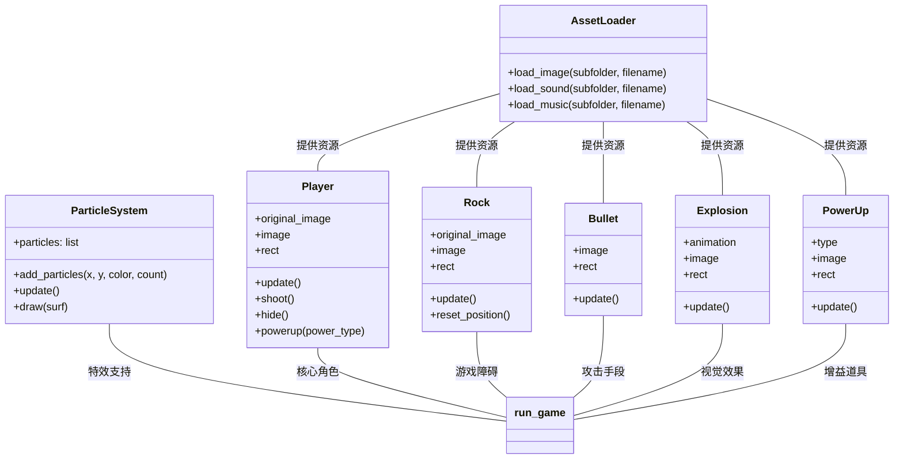

08.10 18:41
# 飞机大战游戏文档
## 游戏概述
飞机大战是一款基于Python和Pygame开发的2D射击游戏，玩家控制一架战斗机在太空中躲避陨石并消灭敌人。游戏具有精美的视觉效果、丰富的音效和流畅的操作体验。

## 功能特点
-  玩家控制战斗机进行移动和射击
-  三种不同大小的陨石（小/中/大），具有不同生命值
- ✨ 粒子系统特效增强视觉体验
- 🛡️ 护盾和武器升级道具
- ⭐ 多生命系统与无敌状态保护
-  实时分数统计和FPS显示
-  游戏开始界面和结束界面
## 安装说明
### 系统要求
- Python 3.7+
- Pygame 2.0+
### 安装步骤
```bash
# 克隆项目仓库
git clone https://github.com/yourusername/plane-war.git
cd plane-war
# 安装依赖
pip install pygame
# 运行游戏
python plane_war.py
```
### 资源文件结构
游戏需要以下资源文件结构：
```
plane_war.py
├── img/
│   ├── background/
│   │   └── background.png
│   ├── explosions/
│   │   ├── expl0.png
│   │   ├── ... 
│   │   └── expl8.png
│   ├── player/
│   │   └── player.png
│   ├── powerups/
│   │   ├── gun.png
│   │   └── shield.png
│   ├── rocks/
│   │   ├── rock_small.png
│   │   ├── rock_medium.png
│   │   └── rock_large.png
│   └── weapons/
│       └── bullet.png
├── sound/
│   ├── background/
│   │   └── background.ogg
│   ├── explosions/
│   │   ├── expl0.wav
│   │   └── expl1.wav
│   ├── player/
│   │   └── rumble.ogg
│   ├── powerups/
│   │   ├── pow0.wav
│   │   └── pow1.wav
│   └── weapons/
│       └── shoot.wav
└── font.ttf
```
## 游戏操作
| 按键 | 功能 |
|------|------|
| ← → 或 A D | 左右移动战斗机 |
| 空格键 | 发射子弹 |
| ESC | 退出游戏 |
| R | 游戏结束后重新开始 |
## 游戏机制
### 得分系统
| 陨石大小 | 生命值 | 得分 |
|----------|--------|------|
| 小型 | 1 | 10 |
| 中型 | 2 | 25 |
| 大型 | 3 | 50 |
### 道具系统
| 道具类型 | 效果 |
|----------|------|
| 护盾(shield) | 恢复20点生命值 |
| 武器升级(gun) | 升级武器（最多3级） |
### 玩家状态
- 初始生命值：100
- 初始生命数：3
- 被陨石撞击后：1.5秒无敌状态
- 武器升级持续：5秒
## 代码结构

## 游戏主循环
```python
def run_game():
    # 初始化游戏组
    all_sprites = pygame.sprite.Group()
    rocks = pygame.sprite.Group()
    bullets = pygame.sprite.Group()
    powerups = pygame.sprite.Group()
    # 创建玩家和陨石
    player = Player()
    for _ in range(8): rock = Rock()
    # 游戏主循环
    while running:
        # 处理事件
        for event in pygame.event.get(): ...
        if not game_over:
            # 更新游戏对象
            all_sprites.update()
            # 碰撞检测
            # 1. 子弹与陨石碰撞
            # 2. 玩家与道具碰撞
            # 3. 玩家与陨石碰撞
            # 渲染画面
            screen.blit(background_img, (0, 0))
            all_sprites.draw(screen)
            # 绘制UI
            draw_score(...)
            draw_health_bar(...)
        pygame.display.flip()
```
## 自定义游戏参数
可以修改以下常量调整游戏体验：
```python
# 在plane_war.py文件顶部
FPS = 60             # 游戏帧率
WIDTH = 500          # 屏幕宽度
HEIGHT = 600         # 屏幕高度
# 玩家属性
PLAYER_SPEED = 8     # 玩家移动速度
PLAYER_LIVES = 3     # 初始生命数
INVULNERABLE_TIME = 1500  # 无敌状态时间(毫秒)
# 陨石属性
ROCK_SPAWN_COUNT = 8 # 同时出现的陨石数量
```
## 常见问题解决
1. **资源加载失败**：
   - 检查资源文件路径是否正确
   - 确保资源文件命名与代码一致
   - 查看控制台输出的错误信息
2. **游戏运行卡顿**：
   - 降低游戏帧率(FPS)
   - 减少同时出现的陨石数量
   - 简化粒子特效
3. **无法控制飞机**：
   - 检查键盘按键是否正常工作
   - 确认游戏窗口处于活动状态
   - 检查代码中事件处理逻辑
## 扩展建议
1. 添加Boss战和特殊敌人
2. 实现关卡系统，难度随时间增加
3. 添加高分榜和存档功能
4. 增加更多武器类型和道具
5. 开发多人合作模式
## 致谢
本游戏基于Bilibili [侯老师游戏编程实战教程](https://space.bilibili.com/2072991755/lists/969798?type=season)开发，特别感谢侯老师的启蒙指导。
---
**开发者**: 杨昱皓  
**版本**: 1.0  
**最后更新**: 2023年10月15日

